<div align="center">
  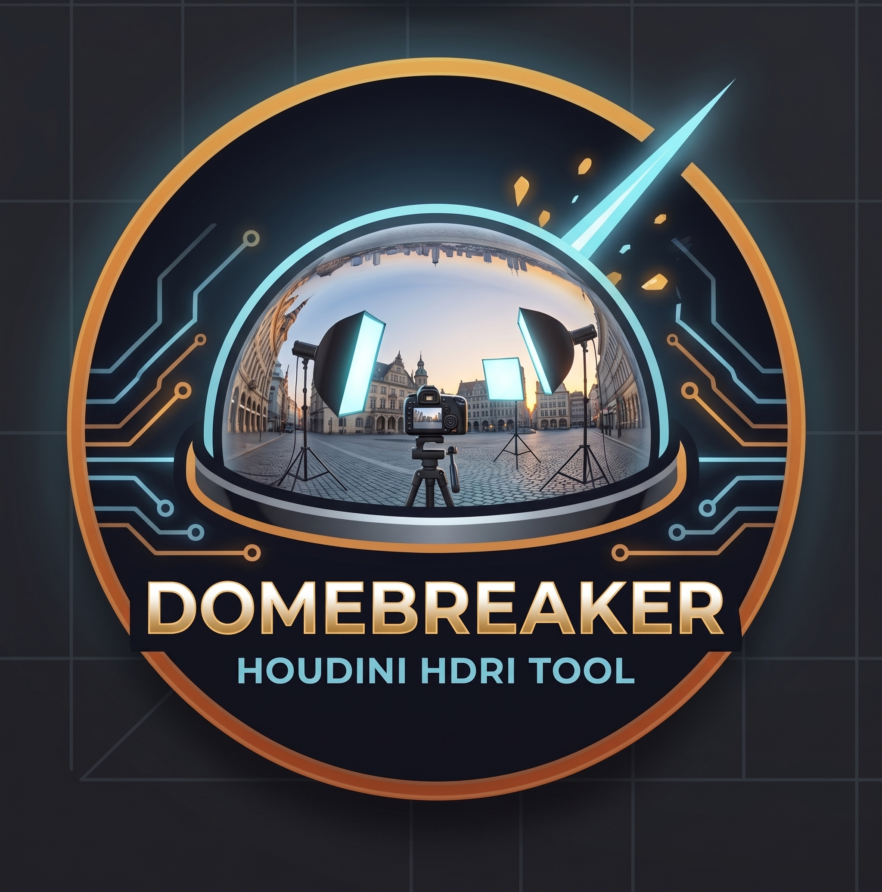
  <h1>⚡ DomeBreaker</h1>
  <p><strong>Production-Grade Solaris USD Lighting, Interior Room Projection & Lookdev Suite for SideFX Houdini</strong></p>

  [](https://www.sidefx.com/)
  [](https://openusd.org/)
  [](#universal-multi-renderer-shader-pipeline)
  [](https://github.com/arslanvision-ux/DomeBreaker/releases)
  [](LICENSE)
  [](#-quick-installation)
</div>

<div align="center">
  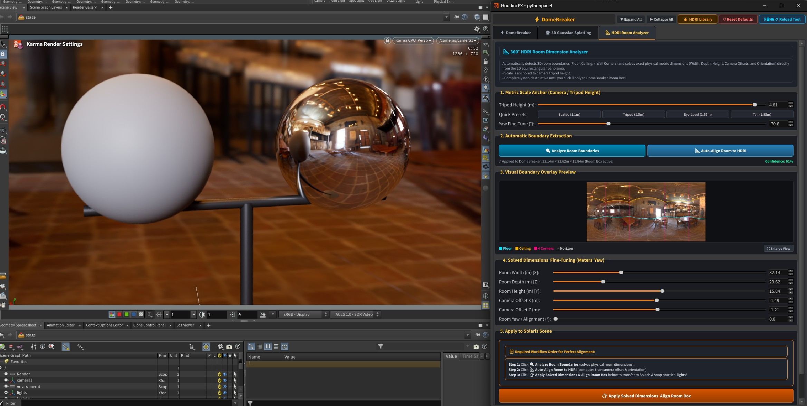
  <p><em>Interactive Karma Lookdev with Chrome & 18% Grey calibration spheres, real-time 360° Room Dimension Analyzer, and live USD stage synchronization.</em></p>
</div>

---
Buy Me a Coffee: https://buymeacoffee.com/arslansvision/domebreaker

DomeBreaker is a high-performance Houdini Solaris / OpenUSD suite engineered to break the traditional limitations of infinite flat environment domes in feature film and episodic VFX pipelines. By transforming 2D equirectangular panoramas into parallax-accurate 3D room boxes, extracting practical lights with automatic inpainting, and constructing native multi-renderer USD networks, DomeBreaker gives lighters and lookdev artists physically plausible ground reflections, localized occlusion, and real-time interactive feedback.

---

## 📸 Visual Showcase

### 1. 📐 3D Interior Room Box & Practical Light Extraction
Extract physical room geometry and practical light sources directly into native OpenUSD `RectLight` primitives with clean inpainting to avoid energy doubling:

| Wireframe Room Box & Inpainting | Live Solaris Lights & Multi-Light Tuning |
| :---: | :---: |
| 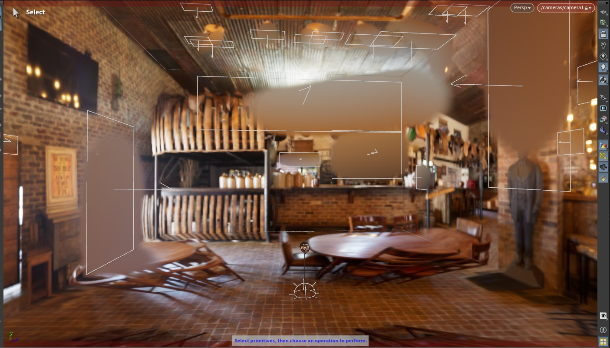 | 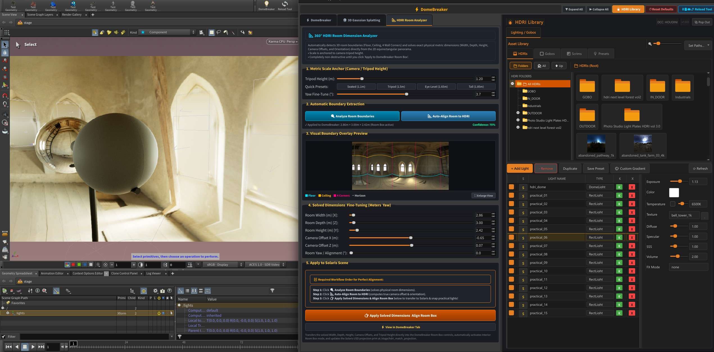 |
| *RectLights flush-snapped to ceiling/walls with background inpainting* | *Interactive multi-light adjustments with live scene graph updates* |

| Lookdev Room Integration | Office Lookdev Setup | Bell Tower Lookdev |
| :---: | :---: | :---: |
| 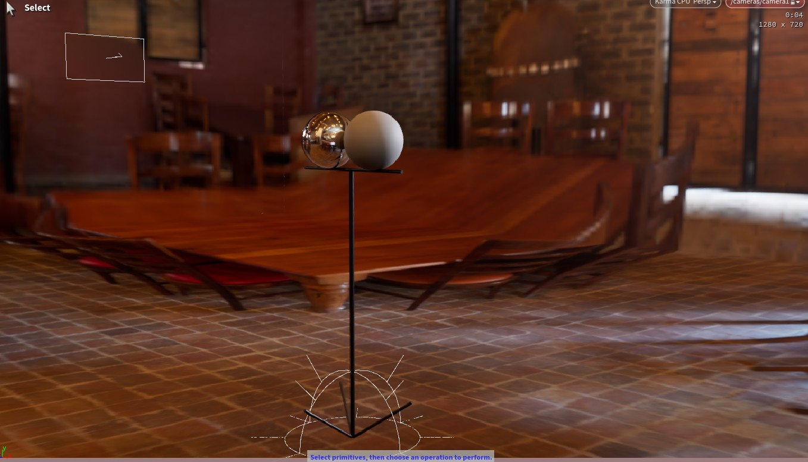 | 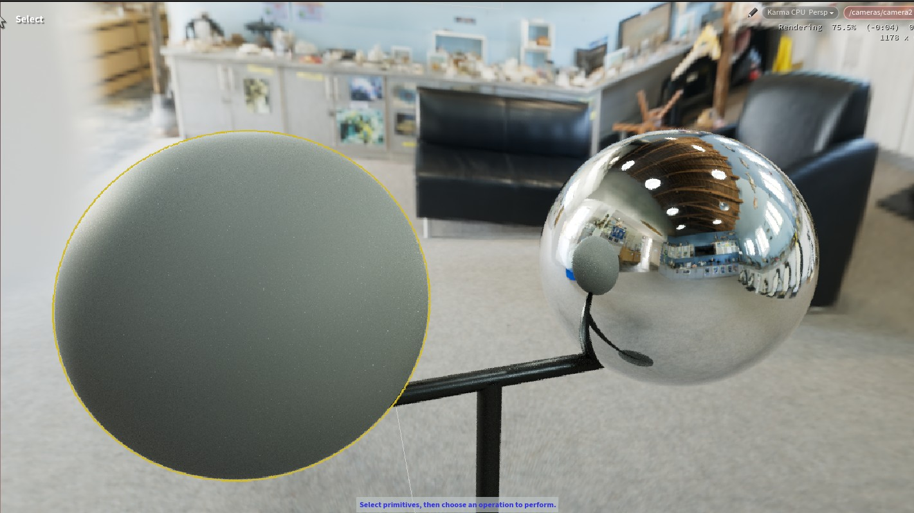 | 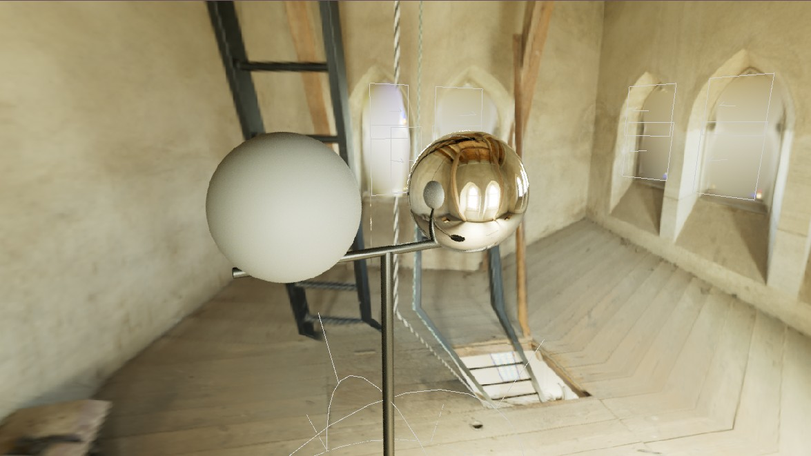 |
| *True local reflection & ground shadow contact* | *Accurate local light reflections on chrome ball* | *Complex architectural environment alignment* |

---

### 2. ☀️ Outdoor Ground Projection & Physical Sun Relighting
Ground disc projection with shadow catcher integration and sub-pixel sun extraction for outdoor environments:

| Direct Sun Extraction & Contact Shadows | Outdoor Lawn Lookdev Test |
| :---: | :---: |
| 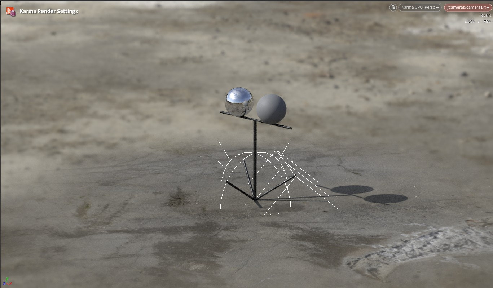 | 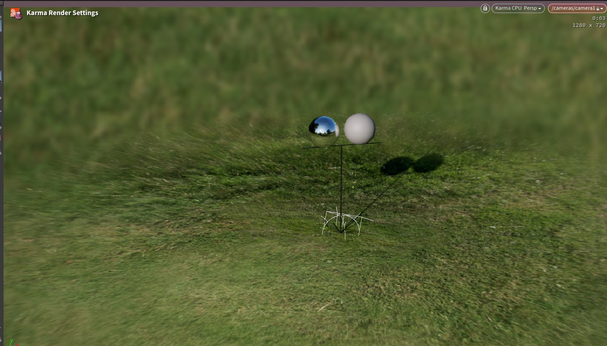 |
| *Ground disc projection with shadow catcher and physical sun ray casting* | *Seamless ground integration with true environmental occlusion* |

---

### 3. 🎛️ Unified Production Interface & Control Panels
A modern, artist-friendly PySide UI built for 60 FPS real-time parameter synchronization:

| Main DomeBreaker Panel (Tab 1) | HDRI Room Dimension Analyzer (Tab 3) |
| :---: | :---: |
| 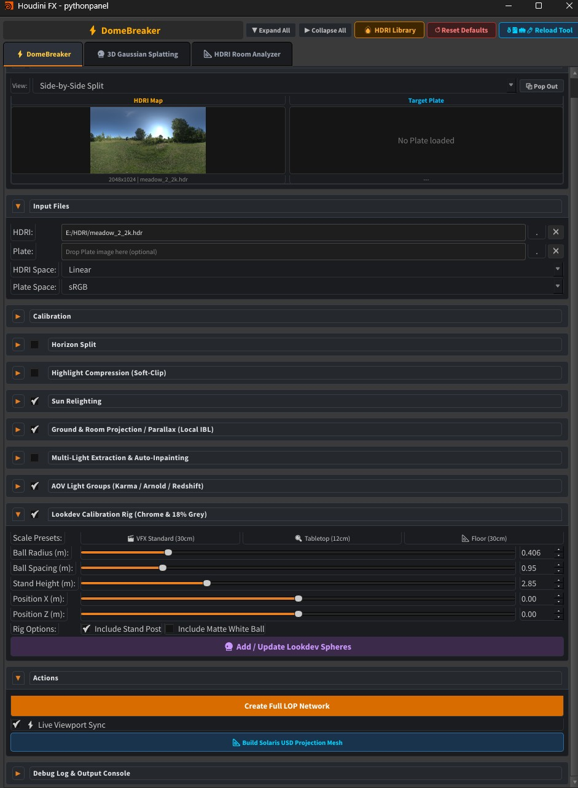 | 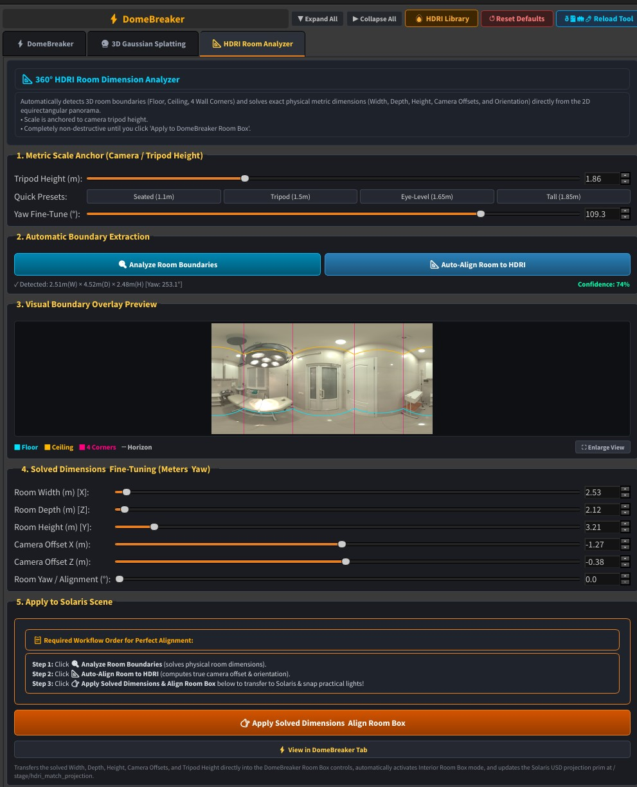 |
| *Lookdev rig controls, sun extraction & live viewport sync* | *Automated boundary extraction with visual overlay & large screen view* |

| 3D Gaussian Splatting (Tab 2) | HDRI & Light Asset Browser |
| :---: | :---: |
| 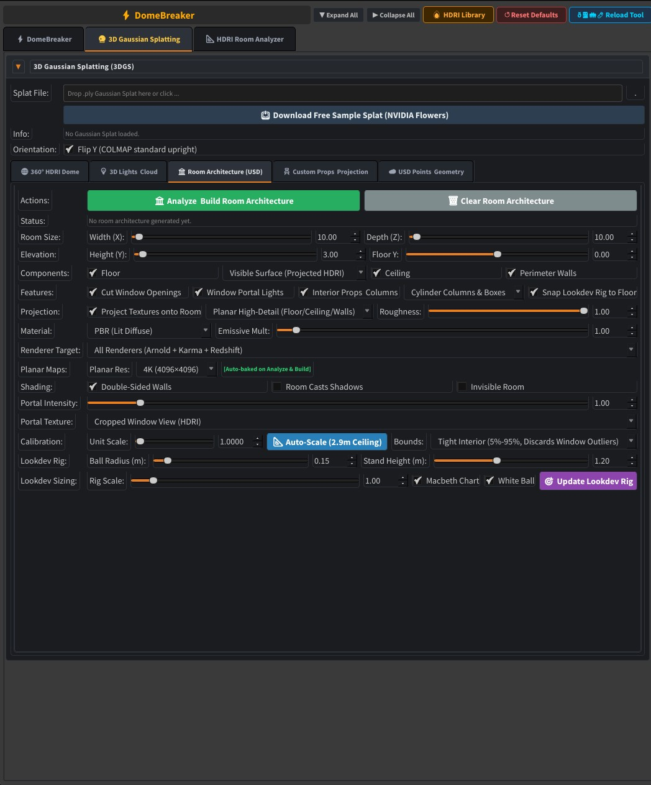 | 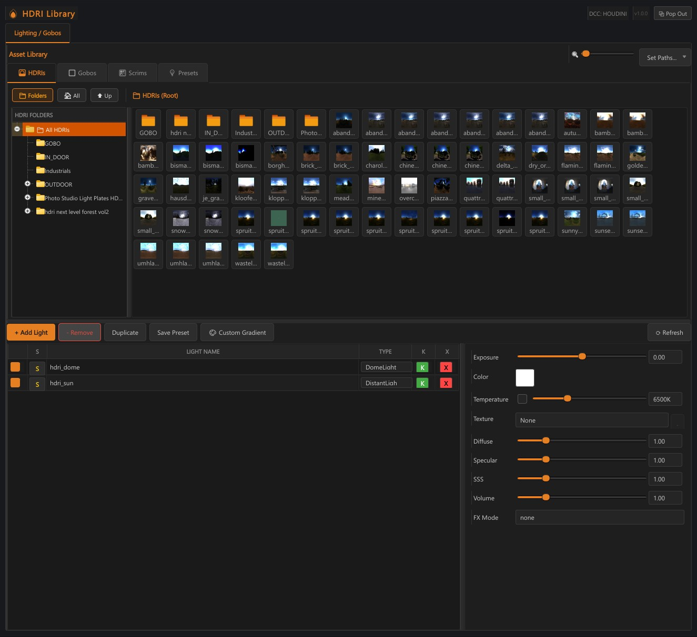 |
| *PLY point cloud ingestion & room architecture generation* | *Organized HDRI asset library with thumbnail browsing* |

| Studio Gobos & Light Textures | Procedural Gradient & Scrim Builder |
| :---: | :---: |
| 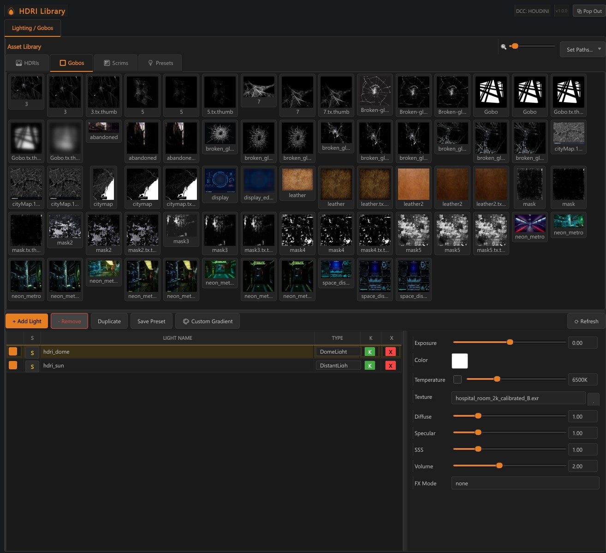 | 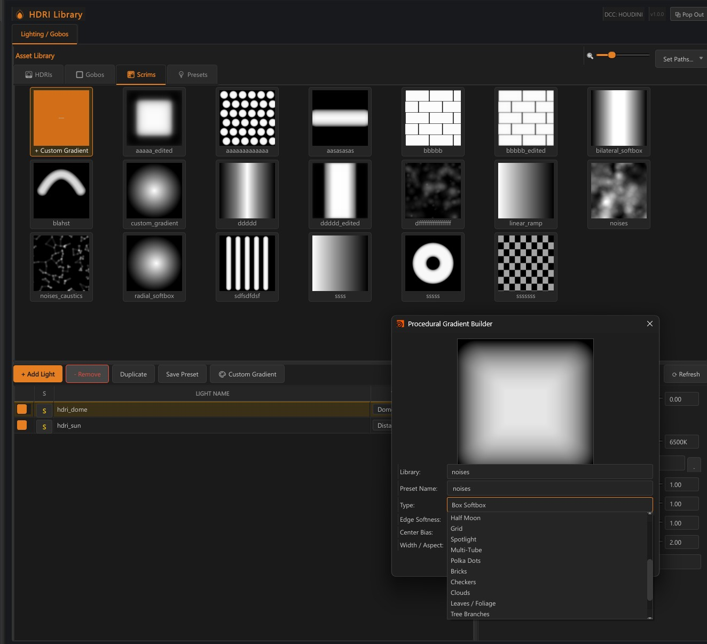 |
| *Curated studio gobo textures & projection masks* | *Interactive softbox, ramp, and procedural gradient generator* |

---

## 🌟 Core Capabilities

### 1. 📐 3D Interior Room Box Projection & Planar Baking
* **Multi-Surface Planar Baking**: Projects equirectangular HDRIs onto 6 clean rectilinear planar textures at up to 8K resolution (Floor, Ceiling, Wall North, Wall South, Wall East, Wall West).
* **Parallax-Correct Lookdev**: CG assets receive physically accurate local reflections and occlusion instead of distorted, distant environment maps.
* **Manhattan Room Architecture Analyzer**: Automatically detects room bounds, floor-to-ceiling heights, and camera tripod offsets with a single click.

### 2. 💡 Practical Light Extraction & Non-Destructive Inpainting
* **Automated Hotspot Extraction**: Scans HDRIs for bright practical light emitters (fluorescents, lamps, windows, downlights) and extracts them into native OpenUSD `RectLight` and `DiskLight` primitives.
* **Non-Destructive Inpainting**: Automatically paints out extracted light sources from the diffuse room textures, preventing double-illumination and energy conservation violations.
* **1:1 Surface Snapping**: Snaps extracted RectLights flush onto the ceiling and wall geometry matching the exact inpaint positions.

### 3. ☀️ Physical Sun Relighting
* Detects solar position, elevation, and azimuth with sub-pixel centroid accuracy.
* Creates directional distant sun lights calibrated to true physical sky models with live contact shadows and ground interaction.

### 4. 🔮 Real-Time Lookdev Calibration Rig
* **Industry Standard Verification**: Chrome mirror, 18% Scene-Linear Neutral Grey, and optional 90% Matte White spheres on a slender anodized metal tripod stand.
* **Scale Presets**: Instant one-click switching between VFX Standard (30cm / 12in diameter on 1m stand), Tabletop (12cm diameter), and Floor (resting on ground).
* **Interactive 60 FPS Viewport Sync**: Ball radius, ball spacing, stand height, and ground positions synchronize live with zero cook delays.

### 5. 🎨 Universal Multi-Renderer Shader Pipeline
Native automated shader network generation across major production render delegates:
* **SideFX Karma CPU / XPU** (MaterialX `open_pbr_surface` and `standard_surface`)
* **Autodesk Arnold** (`aiStandardSurface` and `aiFlat` with camera ray visibility flags)
* **Maxon Redshift** (`StandardMaterial` with USD primvar and projection bindings)
* **UsdPreviewSurface** fallbacks for universal Hydra viewport fidelity.

---

## 🚀 Quick Installation

### Windows (1-Click)
1. Clone or download this repository.
2. Double-click **`install.bat`** (or run `python scripts/install.py`).
3. Launch Houdini.

### Linux (1-Click)
1. Open a terminal in the DomeBreaker folder:
   ```bash
   chmod +x install.sh
   ./install.sh
   ```
2. Launch Houdini.

*For detailed manual installation instructions or studio TD module deployments, see [INSTALL.md](INSTALL.md).*

### 🗑️ Uninstallation
If DomeBreaker is already installed:
* Running **`install.bat`** / **`install.sh`** automatically detects existing installations and prompts to **Uninstall** or **Reinstall/Update**.
* Direct 1-click uninstall: double-click **`uninstall.bat`** (Windows) or run **`./uninstall.sh`** (Linux).
* Manual: Simply delete `domebreaker.json` from your Houdini `packages` directory.

---

## 🔄 Instant Updates (Command-Line)

When a new version or fix is published, you do **not** need to re-download or reinstall:

* **Windows**: Double-click **`update.bat`**
* **Linux**: Run `./update.sh`

The updater automatically pulls changes from GitHub (`https://github.com/arslanvision-ux/DomeBreaker`), seamlessly updates all code and shelf tools, and preserves your custom scenes.

---

## 📖 Step-by-Step Tutorial: Interior Lookdev & Room Box Lighting

When lighting an interior from an HDRI, an infinite dome light causes flat, unoccluded ambient light that leaks through walls. **DomeBreaker** solves this by converting the panorama into a **3D perspective-mapped architectural room box** with realistic parallax, correct wall occlusion, floor bounce, and physical window/lamp portals.

---

### The Core 4-Button Sequence

Once your HDRI is loaded and you have set **Projection Mode: Room Box**, scroll down to the **Room Boundary Analyzer** section and execute this exact sequence:

`	ext
[Step 1] 🔍 Analyze Room Boundaries
    ↳ Detects physical room Width, Depth, and Height via computer vision

[Step 2] 📐 Auto-Align Room to HDRI
    ↳ Computes Camera Tripod Height, X/Z Offsets, and Yaw Orientation

[Step 3] 👉 Apply Solved Dimensions & Align Room Box
    ↳ Pushes solved physical dimensions and camera offsets into DomeBreaker

[Step 4] 📐 Build Solaris USD Projection Mesh
    ↳ Constructs the live 3D USD room box on the /stage
`

---

### Detailed Walkthrough

#### 1. Load & Calibrate Your Interior HDRI
* In **Section 1: HDRI Setup & Calibration** (top of the panel):
  * Click **Browse** and select your interior .hdr or .exr panorama (e.g. living_room.hdr, hotel_room.exr).
  * The thumbnail preview, resolution, and dynamic range stats will appear immediately.
  * *(Optional)* If your HDRI contains a Macbeth ColorChecker, click **Auto-Crop & Calibrate Macbeth** to normalize exposure and white balance to ACEScg standards.

#### 2. Select Room Box Projection Mode
* In **Section 2: Projection & Spatial Geometry**:
  * Set the **Projection Mode** dropdown to **Room Box (Walls, Floor & Ceiling)** *(instead of Infinite Dome or Ground Plane)*.

#### 3. Computer Vision Room Boundary Analysis
* Under the **Room Boundary Analyzer** section:
  1. Click **🔍 Analyze Room Boundaries**:
     * Scans the equirectangular image for ceiling/wall corners, floor/wall baselines, and perspective vanishing points.
     * Generates initial estimates for **Width**, **Depth**, and **Height** (e.g. 6.2m × 8.4m × 3.1m).
  2. Click **📐 Auto-Align Room to HDRI**:
     * Solves the photographer's camera tripod height (1.2m – 1.6m), camera X/Z center offsets, and room yaw rotation.
     * Aligns the perspective wireframe directly with the panorama.
  3. **Inspect the Visual Boundary Overlay**:
     * Cyan lines indicate wall/ceiling junctions; green lines indicate floor baselines.
     * **Tip**: **Double-click the preview image** to open the interactive **Large Screen View** window for real-time inspection.
  4. Click **👉 Apply Solved Dimensions & Align Room Box**:
     * Locks in the solved room dimensions and camera offsets.
     * Pre-aligns wall planes for light snapping.

#### 4. Build the 3D Solaris USD Projection Mesh
* Click the primary action button:
  * 👉 **📐 Build Solaris USD Projection Mesh**
* **What happens in Solaris**:
  * Constructs the /stage/room geometry directly on your USD stage.
  * Perspective-projects the HDRI across all 6 planar surfaces (North, South, East, West walls, Floor, Ceiling).
  * As your camera navigates the room in the Solaris viewport, you get **physically correct parallax** and proper wall shadow occlusion.

#### 5. Bake Planar Textures (Zero-Distortion)
* Under **Texture Baking**:
  * Choose your target resolution (e.g. 2048 or 4096).
  * Click **🖼️ Bake Planar Textures**.
  * DomeBreaker generates 6 distortion-free rectilinear OpenEXR texture maps and assigns them to native **Karma / Arnold / Redshift / RenderMan** physical shaders in the stage material library.

#### 6. Extract Windows & Lamps as Physical USD Lights
* In an interior, light bulbs and windows should emit direct illumination and sharp specular highlights:
  1. In **Section 3: Practical Light Extraction**, click **💡 Extract Practical Lights**.
     * Automatically identifies hotspots and creates native USD RectLight and DiskLight primitives positioned directly against the walls and ceiling with matching Kelvin color temperatures and intensities.
  2. Click **🎨 Inpaint Emitted Hotspots**:
     * Erases bright hotspots from the texture maps so direct illumination is not double-counted.

#### 7. Verify Lookdev in the Viewport
* In **Section 5: Lookdev Rig & Turntable**:
  * Click **🎯 Create Lookdev Turntable Rig** to place calibrated 50% Neutral Grey and 100% Mirror Chrome calibration spheres at the center of the room.
  * Switch your Solaris viewport delegate to **Karma CPU/XPU** (or **Husk / Redshift / Arnold**).
  * The chrome sphere reflects the 3D room with accurate perspective, while the grey sphere shows physical ambient occlusion and directionality from the windows.

---

## 📄 License
This project is licensed under the MIT License - see the [LICENSE](LICENSE) file for details.
